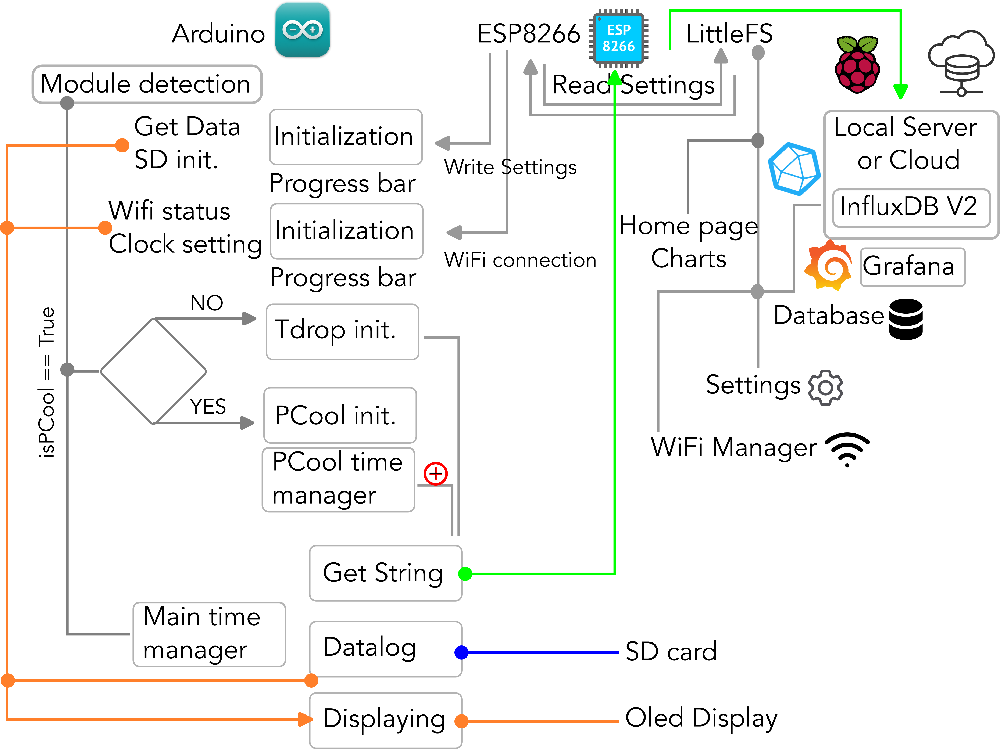
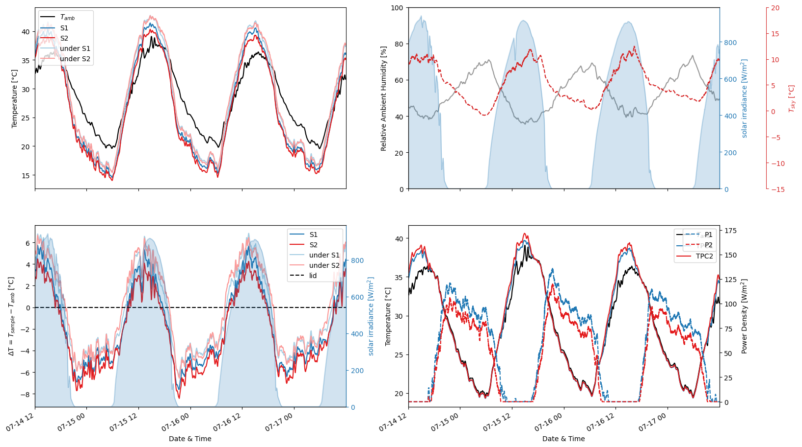
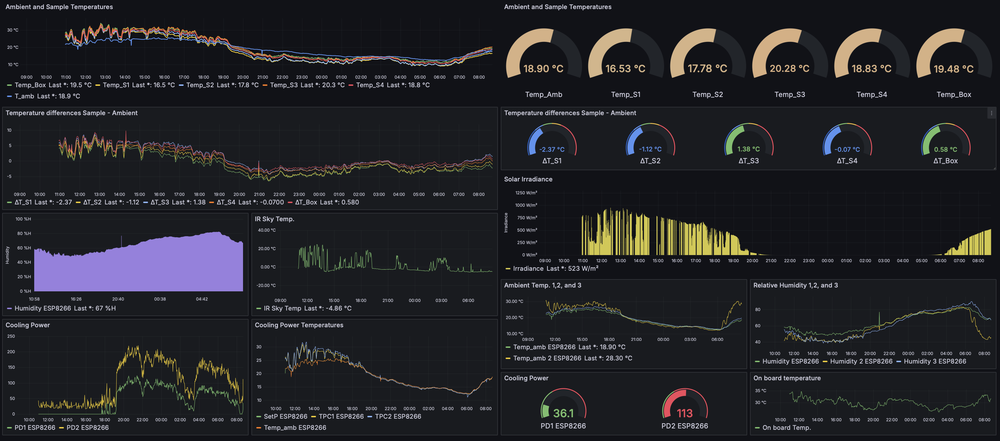

#       PRC Measurement Station including TDrop and PCool

## Introduction and scope 

The code reported in this repository are related to a data logger realization able to measure the temperature drop and the cooling power of "passive radiative cooling" samples. The device is covered by the OSHWA certificate and the GPL license with the UID IT0000015 and the details are available at the [following link](https://certification.oshwa.org/it000015.html) 

  

The board as shown in the figure is composed by a main board, a TDrop shield that allows measuring the temperature for multiple samples, the solar irradiance, the sky temperature using an IR sensor, ambient temperature and relative humidity using a DHT22, store data on a onboard SD card. It is also equipped with a RTC clock for the correct time and a ESP8266-12F module for the WiFi connection and communication. The PCool shield is equipped with NTC to measure the sample temperature and a PID system to warm-up them to the setting point temperature that usually is the ambient temperature. 

The entire documentation will be soon available on the Zenodo repository at the following link [10.5281/zenodo.13624486](10.5281/zenodo.13624486)

Details about the research and the results obtained with FRESCO are available on the following "PrePrint":
Wèrlè, Jeremy and Concas, Roberto and Pini, Ernesto and Wiersma, Diederik S. and Pattelli, Lorenzo and Lio, Giuseppe Emanuele and Administrator, Sneak Peek, FRESCO-Board: A Low-Cost Open Platform for Comprehensive Testing of Passive Radiative Cooling Materials. Available at SSRN: https://ssrn.com/abstract=5132927 or http://dx.doi.org/10.2139/ssrn.5132927

## Acknowledgements.

The inventors of FRESCO acknowledge the economic support offered by the CoolingPhotonics Company in the research project under techonoligcal transfer agreement named "FRESCO - Data Logger".  They also thanks the scientific  fruitful discussion offered in the framework of the PaRaMetric (EURAMET - European Partnership on Metrology), and the technical support offered by the joitlab - electronic workshop- of University of Florence and National Metrology Institute of Italy (INRIM). 

## A supporter is worth a thousand followers.

Dear reader, if you are interested in the development of FRESCO and its improvement with new features, please support our team by using the support button or by going directly to 
. We are actively working to do our best to achieve a reliable passive radiative cooling measurement apparatus. With your support we will move forward in developing new features, improve the web application experience and make it more essential for your experiments. You can support us directly buying coffees, with a membership and sooner directly buying the FRESCO boards. 

##       Software details

  

The schematic representation reports the workflow among Arduino, the ESP8266 for the WiFi communication, data exchange and remote storage using a local server (Raspberry) or cloud based on InfluxDB V2 and Grafana for the data visualization.

In order to use the choseen sensors that equip the TDrop shield such as: BH1750 (irradiance), Dallas DS18B20 (Temperature), DHT22 (temp and Humidity), DS3231 (clocker), and MLX90614 (IR temperature Ambient (near) and Sky (far))
it is necessary to install/ include the available [libraries](https://github.com/GiuseppeELio/FRESCO-Board/blob/main/libraries.zip).

## Temperature probes

In the following downloadable document [NTCs](https://github.com/GiuseppeELio/FRESCO-Board/blob/main/doc/Advised%20NTC%20thermocouples.pdf) you can find the B (K) constant values for the reccomended NTCs that have been tested. 

## ESP8266 WiFi connection and data transmissione. 

As reported in the pdf file ["FRESCO Board startup_Software"](https://github.com/GiuseppeELio/FRESCO-Board/blob/main/doc/FRESCO%20Board%20startup_Software.pdf) the FRESCO board is equipped with a WiFi network board to communicate and exchange information through a network and show the data directly on your device by a hot spot netwrok or connecting on the local IP of the selected WiFi. On the other hand, it allows sending the data on a remote server using Raspberry or a Linux PC/Server and then save the data on "InfluxDB V2" and display them on "Grafana" dashboard. 

## Python Temperature Drop and Cooling Power analysis 
Using the provided Jupyter Notebook [analysis.ipynb](https://github.com/GiuseppeELio/FRESCO-Board/blob/main/analysis.ipynb) is it possible to display all the information collected using FRESCO and have an immediate look to the passive radiative cooling material features. The python script contains also a initial part that has been tought to merge the collected data stored in different subfolders, it means e.g merging the data in the folder year 2024 --> month 07 --Z from the day 8 to 17. An example is reported below. 

  

## Grafana Dashboard

Here it is reported an example of the full FRESCO dashboard realized using Grafana and it is displaying the temperature for each sensor (DHTs, NTCs, IR) the solar irradiance, the temperature drop in chart and gauges and also the cooling power is reported using charts (power and the setting point temperature) and gauges. You can find at the following link [FRESCO_DashBoard_Grafana.JSON](https://github.com/GiuseppeELio/FRESCO-Board/blob/main/doc/FRESCO_DashBoard_Grafana.JSON) the JSON file to make your dashboard as this one or to customize it.  

  

