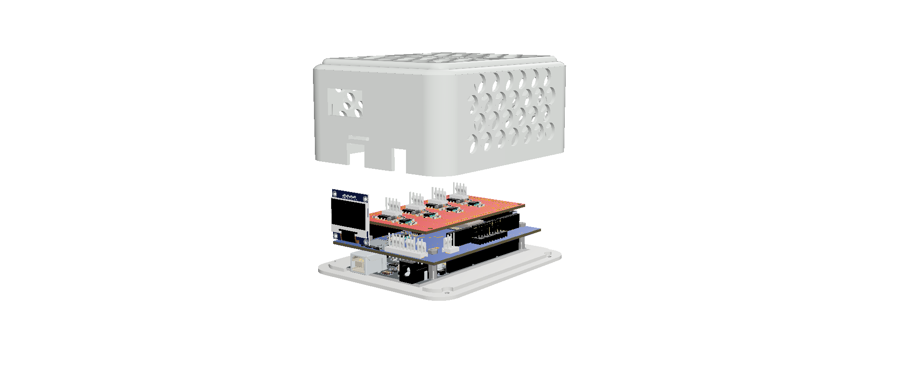

#       PRC Measurement Station including Tdrop and PCool

## Introduction and scope 

The code reported in this repository are related to a data logger realization able to measure the temperature drop and the cooling power of "passive radiative cooling" samples. The device is covered by the OSHWA certificate with the UID IT0000015 and the details are available at the [following link](https://certification.oshwa.org/it000015.html) 

  

The board as shown in the figure is composed by a main board, a TDrop shield that allows measuring the temperature for multiple samples, the solar irradiance, the sky temperature using an IR sensor, ambient temperature and relative humidity using a DHT22, store data on a onboard SD card. It is also equipped with a RTC clock for the correct time and a ESP8266-12F module for the WiFi connection and communication. The PCool shield is equipped with NTC to measure the sample temperature and a PID system to warm-up them to the setting point temperature that usually is the ambient temperature. 

##       Software details

  

The schematic representation reports the workflow among Arduino, the ESP8266 for the WiFi communication, data exchange and remote storage using a local server (Raspberry) or cloud based on InfluxDB V2 and Grafana for the data visualization.

In order to use the choseen sensors that equip the TDrop shield such as: BH1750 (irradiance), Dallas DS18B20 (Temperature), DHT22 (temp and Humidity), DS3231 (clocker), and MLX90614 (IR temperature Ambient (near) and Sky (far))
it is necessary to install/ include the available [libraries](https://github.com/GiuseppeELio/FRESCO-Board/blob/main/libraries.zip).

## ESP8266 WiFi connection and data transmissione. 

As reported in the pdf file ["FRESCO Board startup_Software"](https://github.com/GiuseppeELio/FRESCO-Board/blob/main/doc/FRESCO%20Board%20startup_Software.pdf) the FRESCO board is equipped with a WiFi network board to communicate and exchange information through a network and show the data directly on your device by a hot spot netwrok or connecting on the local IP of the selected WiFi. On the other hand, it allows sending the data on a remote server using Raspberry or a Linux PC/Server and then save the data on "InfluxDB V2" and display them on "Grafana" dashboard. 

## Grafana Dashboard

An example of the dashboard displaying the usefull data is reported below

%%% Work in progress%%% The dashboard Json code will be released soon. 
